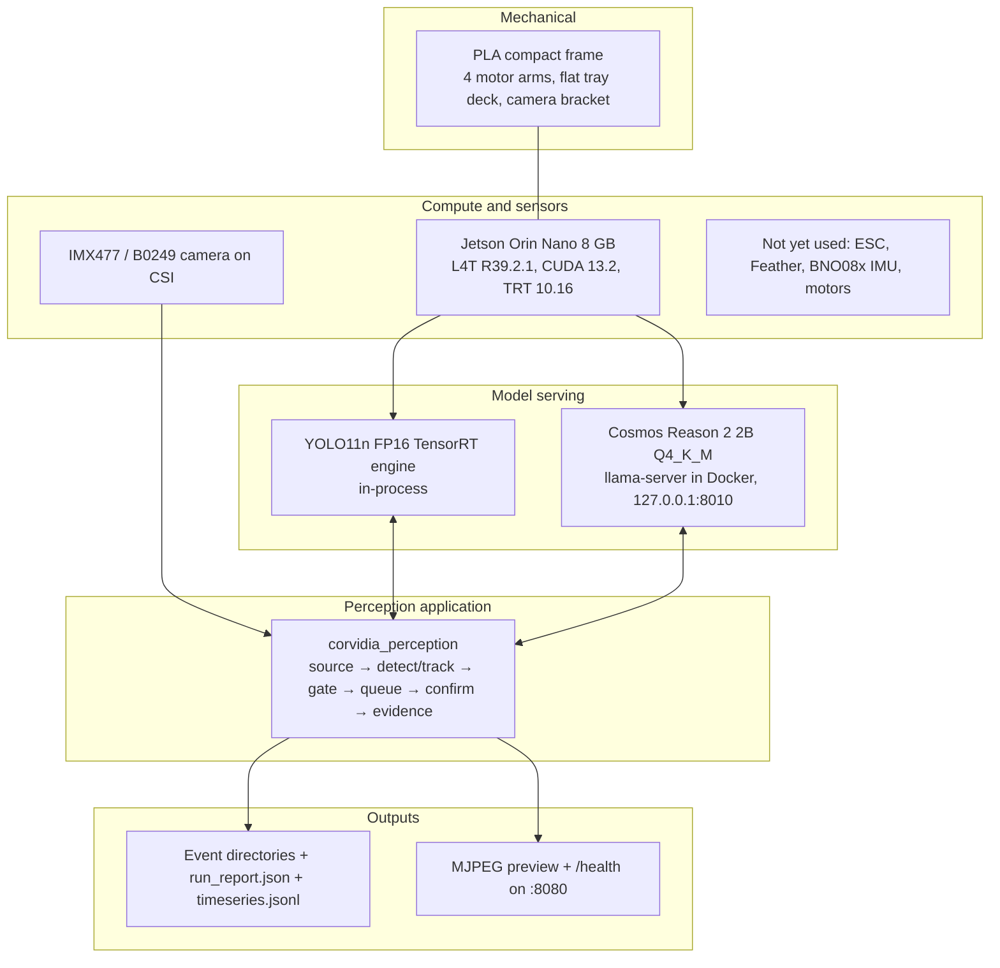
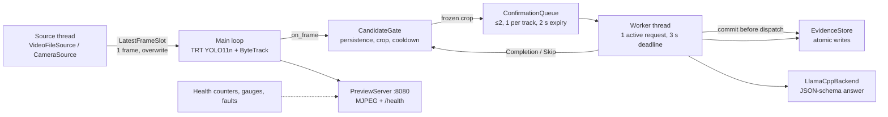
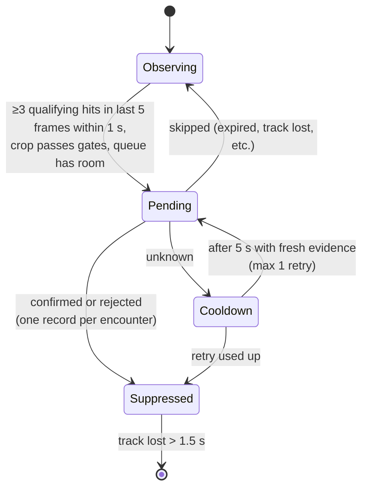

# Corvidia — project handoff

As of 2026-09-27. Branch `perception` (5 commits ahead of `main`, plus uncommitted
step-4 work described in [Work in progress](#work-in-progress-uncommitted)).

Corvidia is a bench demonstrator: a 3D-printed quadcopter-style frame carrying a
Jetson Orin Nano and a CSI camera. The current software milestone ("Scout") is a
**camera-to-event person detection pipeline**: detect a person, track them across
frames, ask a local vision-language model (Cosmos Reason 2 2B) to confirm, and save
reviewable evidence. It produces observation records only — no flight control,
no motion decisions.

## Status at a glance

| Area | State |
|---|---|
| Mechanical frame | Final design done, sliced and software-verified; **never printed**, no physical fit checks |
| Spec | [`docs/event-pipeline.md`](event-pipeline.md), 5 implementation steps |
| Step 1 — event core | Done (commit `f036d5c`) |
| Step 2 — video replay + YOLO/ByteTrack | Done (commit `f036d5c`) |
| Step 3 — local Cosmos confirmer, TensorRT detector | Done and measured on the Jetson (commit `a0eecf5`) |
| Step 4 — Jetson CSI + sustained load | **In progress, uncommitted** (Argus timestamps, sensor modes, soak script, timeseries) |
| Step 5 — evaluation on held-out labeled encounters | Not started |
| Flight control / STM32 / IMU / depth / odometry / ROS 2 | Out of scope for this milestone |

## Repository layout

```text
corvidia/
  README.md                 # top-level overview (still says "no application code" — outdated)
  docs/
    event-pipeline.md       # the spec the perception code implements
    HANDOFF.md              # this file
  hardware/frame/           # mechanical layer (Git LFS for CAD/print files)
    cad/                    # parametric FreeCAD build, slicing, checks, printer profiles
    references/             # manufacturer geometry (Orin, camera, IMU, Feather)
    output/                 # final 3MF, FCStd/STEP/STL, verification JSON, START_HERE.md
  perception/               # software layer (Python 3.12, uv)
    src/corvidia_perception/  # ~3.5k lines, 19 modules
    tests/                    # 53 tests (run on the Jetson only)
    deploy/                   # Jetson scripts: export_yolo.sh, cosmos_server.sh, soak.sh
    tools/build_starter_eval.py
```

## System layers



### 1. Mechanical layer — `hardware/frame/`

- One-piece PLA frame for a Bambu P2S (0.4 mm nozzle, Textured PEI), one 256 × 256 plate,
  ~6 h 4 min and 185 g. Envelope ~240 × 224 × 48 mm.
- Flat 110 × 116 mm center deck (6 mm thick) for the user's existing 95 × 111 mm Jetson tray,
  to be glued. No printed Jetson mounts.
- Four arms tapering 28 → 20 mm; motor centers at (±104, ±96), 11.5 mm pattern, Ø3.4 holes.
- Mount points for ESC (0,-75), Feather (0,+73), IMU (-45,-73), and the B0249 camera
  bracket (front face X=58, optical center Z=26, 34 mm pattern).
- The old M4 bench holes were removed: a bench fixture must restrain the frame separately.
- Print file: `output/Compact_P2S_PLA/Corvidia_Compact_P2S_PLA_Motor_Holes_Fixed.3mf`
  (use this one — an earlier export filled the motor holes).
- Rebuild pipeline (Mac): `cad/compact_frame.py` (FreeCAD Python) → `cad/slice_compact.py`
  (Bambu Studio CLI) → `cad/check_compact.py`. Parameters in `cad/parameters.json` and the
  FreeCAD spreadsheet; open with `cad/Open_Compact.FCMacro`.
- **Unverified physically:** tray height/adhesive, screw engagement, prop clearance, balance,
  strength, vibration, temperatures. See `output/Compact_P2S_PLA/START_HERE.md`.

### 2. Compute and sensors

| Item | Detail |
|---|---|
| Jetson | Orin Nano 8 GB (7.5 GB usable, **unified CPU/GPU memory**), Ubuntu 24.04, Python 3.12.3, Docker |
| Camera | IMX477 (RPi HQ-class), `/dev/video0`, `nvarguscamerasrc`. Sensor modes: 0 = 3840×2160@30, 1 = 1920×1080@60 (binned) |
| Known camera issue | Capped-lens frames look magenta — possibly a missing ISP tuning file; verify with the lens uncapped |
| Other boards | ESC, Adafruit Feather, BNO08x IMU, motors: mounting only, no software yet |

### 3. Model serving

- **Detector:** YOLO11n exported once to an FP16 TensorRT engine (`~/models/yolo11n.engine`,
  `deploy/export_yolo.sh`, ~10 min). The live path (`trt_detector.py`) runs the engine
  directly with zero-copy managed buffers, letterboxing and NMS in NumPy — **no PyTorch or
  Ultralytics at runtime**. PyTorch/Ultralytics live in the optional `detector` extra only
  for export and parity tests.
- **Confirmer:** Cosmos Reason 2 2B, community GGUF `Kbenkhaled/Cosmos-Reason2-2B-GGUF`
  (Q4_K_M + F16 mmproj, revision and sha256 pinned), served by `llama-server` in the Jetson
  AI Lab llama.cpp container (pinned by digest). `deploy/cosmos_server.sh start|stop|status`.
  Flags `-c 2048 -np 1 --cache-ram 0` to keep RAM headroom. Restarts unless stopped.
- Decisions already made: llama.cpp container (not Ollama, not native build, not vLLM for now,
  not TensorRT Edge-LLM). Prefer TensorRT wherever possible.

### 4. Perception application — `perception/src/corvidia_perception/`

#### Runtime data flow and threads



- The source thread only ever keeps the **latest** frame; the detector never blocks on I/O.
- The confirmation worker is a non-blocking state machine (`tick(now)`), run on its own
  thread in production and stepped with a fake clock in tests.
- Queued crops are private frozen copies — the camera cannot overwrite evidence.

#### Module map

| Layer | Modules | Responsibility |
|---|---|---|
| Records | `records.py` | Typed frozen dataclasses: `FrameInfo`, `Frame`, `BBox`, `Detection`, `CandidateKey(session, epoch, track)`, `Candidate`, `Completion`, `Skip`, `Result`, `SkipReason`, `ClockDomain` |
| Config | `config.py` | `PipelineConfig` with sections gate/crop/queue/confirm/storage/detector/tracker/system; TOML-loadable (`--config`) |
| Sources | `sources.py` | Video replay (`every` = accuracy, `realtime` = pacing with drops), Argus CSI via GStreamer, reconnect → new source epoch |
| Detection | `trt_detector.py`, `detector.py`, `bytetrack.py` | TensorRT YOLO; NumPy ByteTrack matching Ultralytics output; tracker aging through dropped frames |
| Event logic | `gate.py`, `crop.py`, `confirm_queue.py` | Candidate lifecycle, 20% padded crop + size/blur gates, bounded FIFO |
| Confirmation | `confirmer.py`, `cosmos.py`, `worker.py` | Backend protocol, strict answer parsing, stub backends, llama-server adapter, deadlines/cancel/drain/recover |
| Persistence | `evidence.py` | Atomic temp+rename writes, storage limits, interrupted-event recovery on startup |
| Wiring | `pipeline.py` | `EventPipeline`, `LatestFrameSlot` |
| Observability | `health.py`, `preview.py`, `run.py` | Counters/gauges/faults, annotated MJPEG preview, run report, system sampler (RAM, temps) |
| Tools | `simulate.py`, `cosmos_eval.py`, `tools/build_starter_eval.py` | Synthetic run, confirmer accuracy/latency eval, starter crop-set builder |

CLI entry points: `corvidia-run`, `corvidia-cosmos-eval`.

#### Candidate lifecycle (per track, `gate.py`)



Queue full → candidate stays eligible; nothing extra is copied into memory. Expired
entries are recorded as **skipped**, not rejected. Source reset or camera loss starts a
new epoch and clears history.

#### Confirmation worker (`worker.py`)

States: `idle → active → (idle | draining) → unavailable`.

- Before dispatch, the candidate's crop/frame are committed to disk. If that fails, no
  dispatch and a storage fault — a result can never exist without evidence.
- Timeout (3 s) → `draining`: request cancellation and wait until the backend confirms idle
  (llama-server `/slots`), up to `drain_s`. No new work meanwhile. If idleness can't be
  established → `unavailable` until `recover()`.
- Late answers for expired request IDs are ignored.
- The model must answer JSON `{"answer": "yes"|"no"|"uncertain"}` (grammar-constrained).
  Only that field is parsed. Everything else — ambiguity, timeout, malformed output,
  context overflow, server down — maps to `unknown` with a reason.
- `person_score` is always `null` for now.

#### Evidence on disk

```text
~/corvidia-data/events/<session_id>/
  <event_id>/frame.jpg    # selected full frame
  <event_id>/crop.jpg     # exact image sent to the model (longest side ≤ 448 px)
  <event_id>/event.json   # candidate, timestamps, model/prompt hash, result, reason
  run_report.json         # detector/loop/frame-age percentiles, drops, events, skips, RAM, temps
  timeseries.jsonl        # (step 4, uncommitted) one drift row every 10 s
```

Defaults: 2 GB storage cap, 1 GB minimum free, confirmed evidence never auto-deleted.
Pose/attitude/distance fields are `null`, `location_status: unavailable`.

#### Key defaults (not yet calibrated)

| Setting | Value |
|---|---|
| Gate | 3 of 5 frames within 1.0 s, min confidence 0.25, lost track 1.5 s |
| Crop | 20% padding, min 24 × 48 px, blur gate disabled (0) |
| Queue | max 2 pending, 2 s expiry |
| Confirm | 3 s deadline, 5 s drain, 1 retry after 5 s cooldown, JPEG q95, max side 448 px |
| Detector | 640 px, predict conf 0.1 (ByteTrack needs weak boxes), IoU 0.7 |
| Tracker | ByteTrack high 0.25 / low 0.1 / new 0.25, buffer 30, match 0.8 |
| System | `memory_low` fault below 1536 MB available |

## Measurements (Orin Nano 8 GB, 2026-09-27)

Cosmos on a 255-crop hand-labeled starter set (`~/corvidia-data/eval/starter`):

| Model, prompt | Person recall | Precision | Background rejected | Cartoons rejected | p50 / p99 |
|---|---|---|---|---|---|
| Q8_0, default | 121/121 | 0.87 | 30/34 | 1/15 | 1.53 / 2.75 s |
| **Q4_K_M, default (deployed)** | 120/121 | 0.95 | 34/34 | 9/15 | 1.35 / 2.46 s |
| Q4_K_M, "physically present" | 41/121 | 1.00 | 34/34 | 15/15 | 1.26 / 2.40 s |

The model never answered "uncertain". Prompt wording swings results hard — don't change it
without a larger held-out set.

Full stack, 4 min real-time replay: 0 dropped frames at 10 fps; detector p50 22.5 ms idle vs
36.5 ms while Cosmos runs (GPU contention); confirmation p50 1.51 s / p99 1.77 s; minimum
available RAM 1.73 GB with the desktop running; max 53.8 °C.

Memory: TensorRT-only pipeline ~655 MB (detector 22.9 ms p50) vs Ultralytics/PyTorch
1,051 MB (52.7 ms). Cosmos server Q4_K_M ~2.9 GB (Q8_0 was 3.8 GB); OS + desktop ~1.9 GB.

Failure paths verified against the real server: mid-generation cancel acknowledged, idle
after ~1.0 s; 4K image → `context_overflow`; stopped server → `server_unavailable`.

## Recent work (2026-09-27)

Step 4 is committed (`261d4fa`). The 30 min soak at 15 W (1080p, Cosmos Q4) ran with no
thermal issue (max 54.6 °C), 106 events (98 confirmed, 7 rejected, 1 timeout), and
confirmation p99 3.0 s. Available RAM fell to 923 MB while the camera ran and recovered
to 1.9 GB after it stopped; the growth is outside our process (camera daemon or GPU
allocations) and is not yet diagnosed.

Since then:

- **Depth:** Depth Anything V2 Metric Small (indoor, up to 20 m; outdoor, up to 80 m) on
  TensorRT FP16, run once per event on the worker thread while Cosmos works. Events get
  `distance_m` (median over the torso region) and a `depth` block marked `uncalibrated`
  until a tape-measure check sets `depth.scale`. `corvidia-depth-check` gives a live
  readout. Engines: `~/models/depth/*.engine` (build with `tools/export_depth.py` + trtexec).
- **Best shot:** the clearest view of each track (confidence x size x sharpness, halved
  at the frame edge) is saved as `best.jpg` / `best.json` in the track's event folder.
- **Step 5 tooling:** `corvidia-record` (threaded JPEG clips + timestamps) and
  `corvidia-encounter-eval` (YOLO alone vs YOLO + Cosmos). Three clips recorded; on them
  YOLO made no false events, so Cosmos showed no measurable benefit, and 4 real people
  produced 32 events (track fragmentation). The "screen" clip only shows the ceiling.
- **Fixes:** TensorRT buffers are mapped pinned memory, not managed memory (Orin has
  `concurrentManagedAccess = 0`; two engines on two threads segfaulted). The confirmation
  deadline is 4 s from when the request is sent. Camera output defaults to 720p.

Open: depth calibration, duplicate-event merging, the memory drift during camera runs,
and hard-negative clips (screens, posters).

## How to work on it

Development happens on a Mac; **tests run on the Jetson only**.

```sh
# Push from the Mac repo root (keeps the Jetson's own .venv)
rsync -az --delete --exclude='.git' --exclude='.DS_Store' --exclude='.venv' \
  --exclude='__pycache__' --exclude='.pytest_cache' ./ jlam@192.168.2.2:corvidia/
ssh jlam@192.168.2.2 'cd ~/corvidia/perception && ~/.local/bin/uv run pytest -q'
```

Network: USB-ethernet link, Mac `192.168.2.1/24` ↔ Jetson `192.168.2.2/24` (NetworkManager
profile `mac-link`, no gateway). The Jetson gets internet from `FIU_SecureWiFi` separately.

One-time Jetson setup (the venv **must** see system OpenCV + TensorRT):

```sh
cd ~/corvidia/perception
uv venv --python /usr/bin/python3 --system-site-packages
uv sync --extra detector
deploy/export_yolo.sh            # builds ~/models/yolo11n.engine
deploy/cosmos_server.sh start    # fetch pinned weights, run llama-server container
```

Common runs (on the Jetson, in `~/corvidia/perception`):

```sh
uv run corvidia-run --video /usr/share/opencv4/samples/data/vtest.avi --mode every
uv run corvidia-run --video /usr/share/opencv4/samples/data/vtest.avi --mode realtime --speed 4
uv run corvidia-run --camera --confirmer cosmos --preview-port 8080   # http://192.168.2.2:8080/
uv run corvidia-cosmos-eval --dataset ~/corvidia-data/eval/starter --checks
deploy/soak.sh start 60
```

Useful flags: `--confirmer cosmos|yes|no|uncertain`, `--stub-delay 0.8`, `--duration 60`,
`--config settings.toml`, `--model ~/models/yolo11n.pt` (PyTorch path).

Tests (53): `test_lifecycle.py` (18, gate/queue/worker state machines with a fake clock),
`test_step2.py` (15, sources, replay, tracker, run), `test_failures.py` (8, storage/backend
faults), `test_cosmos.py` (6, adapter), `test_units.py` (6).

## Gotchas

- **RAM headroom is a hard requirement.** Unified memory: keep ≥ ~1.5 GB available at peak
  with the full stack. Prefer Q4_K_M, small context, one slot, headless mode. Report measured
  headroom with any config change.
- **Clock drift.** The Jetson RTC drifts and NTP is blocked on campus. TLS errors like
  "certificate is not yet valid" mean the clock is wrong:
  `ssh jlam@192.168.2.2 "sudo date -s '$(date -u +%Y-%m-%d\ %H:%M:%S)'"`.
- **Wi-Fi.** FIU captive-portal networks (`fiu-scs`, `FIU_WiFi`) break pip/git. Use
  `FIU_SecureWiFi`. macOS Internet Sharing doesn't work on this Mac — don't bother.
- `pyproject.toml` blocks pip OpenCV and pins NumPy < 2 to match system cv2 4.8.
- PyTorch comes from the cu130 index, which has no native sm_87 build;
  `test_gpu_detections_match_cpu` guards correctness. Ultralytics with `device=cpu` hides
  CUDA for the rest of the process.
- `jlam` is not in the `docker` group; the Cosmos script uses `sudo docker`.
- Unused leftovers on the Jetson: native llama.cpp build in `~/src/llama.cpp`, Q8 weights in
  `~/models/hf-cache`.
- Git LFS is required for CAD/print files (`git lfs pull`).

## Open issues and next steps

1. Finish and commit step 4 (above).
2. **Step 5 evaluation:** YOLO alone vs YOLO + Cosmos on held-out labeled encounters —
   event precision/recall, missed people, unknowns, duplicates, confirmation delay.
3. Hard negatives (screens, printed photos, mannequins, statues) and a held-out split
   before any prompt change.
4. Spatial/temporal deduplication of fragmented tracks (ID switches on `vtest.avi` create
   extra events). Exact unique-person counting isn't supported without re-ID.
5. Calibrate gate/crop/tracker thresholds and the blur gate from real footage.
6. Dataset-collection retention quotas.
7. Investigate the magenta camera frames (ISP tuning file).
8. Print the frame and do the physical checks listed in `START_HERE.md`.
9. Update the top-level `README.md` (it still says no application code exists).
10. **Licensing:** YOLO11n/Ultralytics are AGPL-3.0 — a commercial product needs a license
    or a different detector.
11. Later: depth/odometry as optional observation producers; a flight supervisor that
    consumes events. `confirmation_started/complete` must never implicitly mean stop or
    resume flight.
