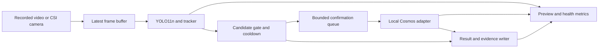

# Scout person detection and confirmation pipeline

Status: proposed implementation specification, September 26, 2026.

## First milestone

Run a complete camera-to-event pipeline on the Jetson: detect a person, follow
the candidate across frames, request local model confirmation, and save reviewable
evidence. Develop and test the event logic with recorded video before using CSI.

This milestone has no dependency on the STM32, IMU, depth model, odometry, or ROS 2.
It produces observation records only. Flight commands and motion decisions belong
to a future integration with an explicit control interface.

Success means that the pipeline handles repeated detections, several people,
slow inference, unavailable inference, camera loss, and storage errors without
an unbounded queue or an incorrect confirmation record. Detection quality and
Jetson performance must be measured separately from event-logic correctness.

## Data flow



Camera acquisition and detection run continuously. Confirmation is event driven.
An asynchronous worker keeps the detector from waiting for HTTP or disk I/O;
it does not guarantee GPU isolation. The benchmark must measure detector
slowdown during image encoding, prefill, and answer generation.

## Components

| Component | Responsibility |
| --- | --- |
| Frame source | Emit an image, source ID, frame ID, dimensions, and timestamps. Support video replay first, CSI second. |
| Detector and tracker | Run YOLO11n and an explicitly configured ByteTrack tracker. Preserve detection confidence and track IDs. |
| Candidate gate | Require repeated evidence for the same track, select a useful crop, suppress repeated requests, and enforce queue limits. |
| Confirmer | Call a local Cosmos server through a replaceable adapter and normalize responses and errors. |
| Evidence writer | Save the exact input image/crop and metadata, then commit the final result. |
| Health reporter | Report source age, detector timing, queue depth, dropped work, model errors, and storage failures. |

Use one Python application process initially, with separate acquisition,
inference, and I/O workers as needed. Keep the local model server separate.
Prefer simple typed records and bounded in-process queues over a message broker.
Shared frame ownership must be explicit: queued crops must not reference an
image buffer that the camera can overwrite.

## Candidate lifecycle

Each candidate is keyed by `(session_id, source_epoch, track_id)`. Start a new
source epoch after reconnecting or seeking video; tracker IDs alone are not
durable identifiers and do not identify a person across sessions.

1. **Observing:** gather detections for the same track.
2. **Eligible:** pass the persistence and crop-quality gates.
3. **Queued:** reserve one bounded queue entry and freeze an immutable crop.
4. **Confirming:** submit exactly one request for this candidate.
5. **Complete:** save `confirmed`, `rejected`, or `unknown`, with a reason.
6. **Suppressed:** apply encounter deduplication or a retry cooldown.

Suggested initial configuration, subject to recorded-video evaluation:

| Setting | Initial value or rule |
| --- | --- |
| Candidate gate | At least 3 qualifying detections among the last 5 processed frames, within 1 second |
| Detection confidence | Configurable; select from labeled footage rather than treating a default as calibrated |
| Crop | Bounding box plus 20% padding per side, clamped to image bounds; save actual crop coordinates |
| Quality gate | Reject empty/tiny crops; tune minimum size and blur limits from footage |
| Camera-to-detector buffer | One pending latest frame; replace superseded frames |
| Confirmation concurrency | One active server request |
| Pending confirmation queue | At most 2 candidates; one entry per track; FIFO admission |
| Pending queue expiry | 2 seconds of host monotonic time |
| Confirmation deadline | 3 seconds initially; benchmark before choosing the deployed value |
| Retry after unknown | At most one retry per encounter, after a 5-second cooldown and fresh evidence |
| Confirmed encounter | One confirmation record while the same track persists |
| Lost-track expiry | Reset candidate history after a configured gap; never count widely separated observations as consecutive evidence |

Apply the persistence test to timestamped observations, not just a counter.
Clear old observations on camera loss, source reset, and long processing gaps.
Advance tracker aging consistently when capture frames are dropped.

When the queue is full, leave candidates eligible for a later fresh observation;
do not copy additional images into memory. Expired entries are recorded as
skipped, not as model rejections. A candidate that disappears before dispatch
is skipped in live mode. A completed result remains tied to its original image,
even if the person has since left the frame.

Track fragmentation can produce duplicate encounters. Evaluate a short temporal
and spatial deduplication window, while reporting its limitations: without pose
or person re-identification, exact unique-person counting is not supported.

## Confirmation contract

Start with a categorical result. A probability score is optional and nullable.

Prompt draft:

> Does this image visibly contain a real human, rather than only a picture,
> screen image, statue, or mannequin? Answer yes, no, or uncertain. Use uncertain
> when the image is too small, blurred, or ambiguous to decide.

Validate this definition with labeled crops, including occlusion, unusual poses,
screens, mannequins, shadows, blur, and small distant people. A single image may
not distinguish a real person from a realistic depiction; preserve uncertainty.

| Result | Meaning |
| --- | --- |
| `confirmed` | A valid affirmative answer under the configured decision rule |
| `rejected` | A valid negative answer |
| `unknown` | Ambiguous answer, timeout, malformed output, context overflow, server unavailable, or other inference error |

Use constrained categorical output when supported by the pinned backend. Verify
the model's chat template and tokenization. Do not assume one output token can
represent the complete response. Parse only the expected answer field; never
search arbitrary generated prose for the substring `yes`.

For the first implementation, use `person_score: null`. If later supported,
explicitly score the complete candidate answers and document raw versus
processed log-probability behavior. Top-five token log probabilities do not
guarantee that both answers are present. Evaluate calibration on held-out
flights or locations before calling the result a probability.

A client timeout does not prove that GPU inference stopped. Disable automatic
transport retries. After timeout, request cancellation where supported and do
not dispatch new work until completion or cancellation is acknowledged. If the
backend cannot establish that it is idle, mark it unavailable and require a
controlled recovery. Ignore late results for expired request IDs.

## Evidence and timestamps

Assign an event UUID before inference and preserve the exact submitted crop.
When storage is enabled, commit candidate evidence before dispatch, using a
bounded asynchronous writer. If that write fails, skip dispatch and surface a
storage fault so that a result cannot be reported as successfully captured.

An event directory contains:

```text
events/<session_id>/<event_id>/
  frame.jpg          # original selected frame, subject to configured retention
  crop.jpg           # exact encoded image submitted to the confirmer
  event.json         # candidate details, final result, or interrupted status
```

Metadata includes:

- Schema version, event/session/source IDs, source epoch, frame ID, and track ID.
- Capture timestamp when supplied by the source, its clock domain and quality,
  plus host arrival time. Use monotonic time for local deadlines.
- Video presentation timestamp for replay; it is not a real-world UTC timestamp.
- Bounding box, padded crop coordinates, image dimensions, detector confidence.
- Model/checkpoint revision, backend version, prompt hash, and decision settings.
- Result, reason, nullable score, queue delay, inference duration, and commit time.
- `pose: null`, `attitude: null`, `distance_m: null`, and `location_status: unavailable`.

Write files through temporary names and atomic rename on the same filesystem;
publish a completed record only after required files are committed. On startup,
identify incomplete events and mark them interrupted instead of confirmed.

Use configurable storage limits and minimum free-space thresholds. Disable
automatic deletion of confirmed evidence by default. At the storage limit,
stop admitting capture events and show a fault while maintaining preview and
detection if possible. Dataset collection mode retains rejected/unknown samples
under an explicit quota; routine operation uses a narrower retention policy.

## Backend and deployment decisions

Keep the application independent of the serving engine. Compare Cosmos on
llama.cpp and vLLM on the actual Orin Nano with the detector active. Jetson AI
Lab currently recommends llama.cpp for Orin Nano and also provides a
memory-constrained vLLM recipe using an FP8 checkpoint.

Pin the model, quantization, container digest, processor, prompt, and API
behavior for each benchmark. Validate actual processed image-token counts;
crop dimensions alone do not establish context usage. Record peak total system
memory during startup and sustained inference, including CPU allocations and
camera buffers. Never infer free RAM solely from a vLLM utilization fraction.

Depth and odometry can be added later as optional observation producers. Keep
their values unavailable until implemented and validated. A future flight
supervisor may consume observation events, but `confirmation_started` or
`confirmation_complete` must never implicitly mean stop or resume flight.

## Implementation and validation sequence

1. **Event core:** typed records, candidate lifecycle, bounded queues, stub
   confirmer, evidence writer, and deterministic detection-event fixtures.
2. **Video replay:** real YOLO11n tracking, preview, crop selection, and event
   records. Test both processing every frame for accuracy and real-time replay
   with deliberate frame dropping for timing behavior.
3. **Local Cosmos:** validate categorical answers, template, context length,
   deadlines, cancellation behavior, and error mapping on saved crops.
4. **Jetson CSI:** integrate the actual camera mode and capture timestamps,
   then measure the complete pipeline under sustained load.
5. **Evaluation:** compare YOLO alone with YOLO plus Cosmos on held-out labeled
   encounters. Report event precision/recall, missed people, unknown outcomes,
   duplicate records, and confirmation delays.

Required behavioral checks:

- A persistent track creates one confirmed event; a different track is eligible.
- Interleaved detections from different tracks cannot satisfy one candidate gate.
- Short flicker or stale observations do not trigger confirmation.
- Queue overflow, expiry, track loss, and source restart have deterministic outcomes.
- Slow or unavailable inference does not block frame acquisition or grow memory.
- Timeout followed by a late answer cannot create a second or false confirmation.
- Disk-full and interrupted writes cannot produce a successful capture record.
- Missing pose, attitude, or distance never blocks an otherwise valid event.

Record detector frame age and throughput, p50/p95/p99 confirmation latency,
queue/skipped counts, peak RAM, and thermal behavior. Set deployment targets
after a baseline measurement; no flight-readiness claim follows from this phase.

## References

- [Ultralytics tracking documentation](https://docs.ultralytics.com/modes/track/)
- [Cosmos Reason 2 2B on Jetson](https://www.jetson-ai-lab.com/models/cosmos-reason2-2b/)
- [vLLM structured outputs](https://docs.vllm.ai/en/latest/features/structured_outputs/)
- [vLLM engine configuration and log-probability modes](https://docs.vllm.ai/en/latest/configuration/engine_args/)
